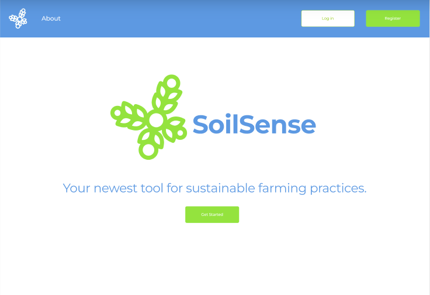
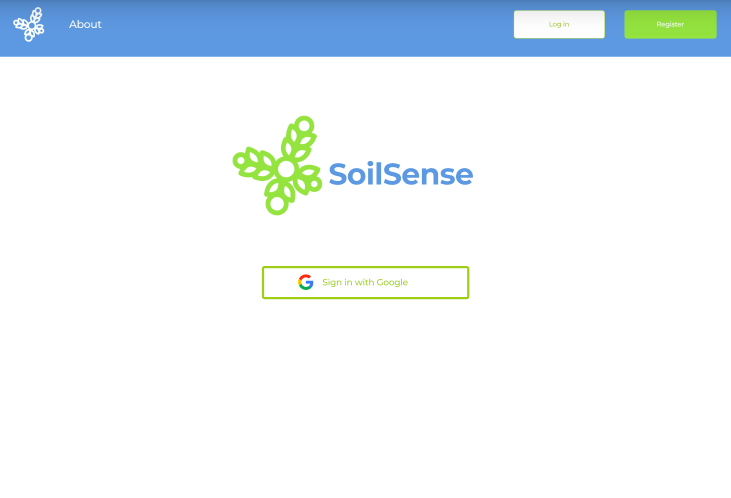
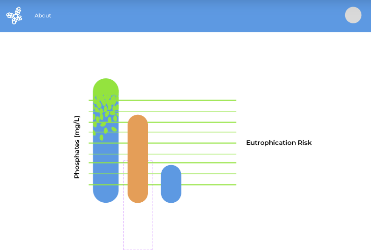
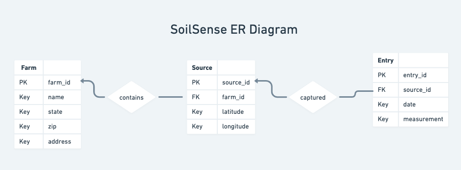

# Pest Control Hackathon

## Team Members

- Joseph Bereswill
  - Computer Science & Business '24
  - <jab324@lehigh.edu>
- Steven Kravitz
  - Computer Science & Business '24
  - <swk324@lehigh.edu>
- Zeeshan Khan
  - Computer Science & Engineering '24
  - <zek224@lehigh.edu>
- Bharath Jyothi
  - Computer Science & Business '24
  - <bhj224@lehigh.edu>
- Jordan Schrier
  - Computer Science & Design '25
  - <jls225@lehigh.edu>

## Problem Statement

Design a technology-based solution that aims to tackle an issue related to one of the climate change subtopics presented earlier: 

1. sustainability
2. saving the ocean
3. disaster management

### Chosen Case Problem: 
#### Examining Phosphate levels in agricultural soil, contaminating nearby crops and water sources for farmers

Phosphate is a naturally occurring mineral that is essential for plant growth, but too much of it can have negative impacts on both soil and water quality. When farmers apply excessive amounts of phosphate-based fertilizers, the excess phosphate can accumulate in the soil, leading to soil degradation and decreased crop yields over time.

Furthermore, when phosphate from fertilizers is washed away by rainfall or irrigation, it can enter nearby water bodies, causing an overgrowth of algae and other aquatic plants. This process, known as eutrophication, depletes oxygen levels in the water, leading to the death of fish and other aquatic animals. Eutrophication can also cause the release of toxic chemicals that can harm human health, making it a significant environmental concern. Therefore, it is important for farmers to use phosphate-based fertilizers judiciously to maintain healthy soil and water ecosystems.

In 1986, the Environmental Protection Agency (EPA) established the following recommended criteria for phosphorus: No more than 0.1 mg/L for streams that do not empty into reservoirs; no more than 0.05 mg/L for streams discharging into reservoirs; and no more than 0.024 mg/L for reservoirs.

## Proposed Solution

Our proposed solution to the problem of soil contamination due to high phosphate levels is to develop a web application using Google Cloud Platform's App Engine. The application will utilize the Google Maps API to map the land coverage and other external datasets to evaluate if a farmer's soil is potentially contaminated by providing visualizations with python modules such as matplotlib. By monitoring phosphate levels in the soil, farmers can take corrective measures to prevent soil degradation and increase crop yields. This web application will provide real-time monitoring of soil health, allowing farmers to make data-driven decisions that will ultimately lead to more sustainable farming practices.

This potential web application has the potential to significantly impact the agricultural industry by providing farmers with a user-friendly tool to monitor the health of their soil. By detecting potential contamination and providing recommendations for remediation, this tool can improve crop yield, reduce environmental harm, and ultimately benefit both farmers and consumers. Additionally, this web application can help reduce the cost of monitoring soil health, as it is an affordable and scalable solution that can be used by farmers of all sizes.

## Run Instructions

To run on local server: 

1. cd into working directory pest-control

2. run, *bash run.sh*

3. redirect to local host: 
  - <http://127.0.0.1:8000>

To run on Google Cloud Platform (GCP) App Engine:

1. Deploy by running GCP SDK in the project directory

2. open the application website with this url: 
  - <https://pest-control-2.uk.r.appspot.com>

## UI Mockups

## Software Architecture

#### Database:
  - MySQL hosted on **Google Cloud Platform's** **App Engine** in conjunction with the **Google SQL Database**

#### Backend:
  - Locally configured routes in Java hosted on **FastAPI**

### Frontend:
  - Written in HTML, Javascript, and CSS
  - Map display using **Google Maps API**

## Entity-Relationship (ER) Diagram

## Venture Capital Funding & Stakeholder Impact

Over the past decade, there has been a growing interest in funding ventures related to soil health monitoring, both from venture capital firms and the government. The primary focus of these ventures has been to create innovative technologies and solutions to monitor soil health and help farmers optimize their crop yields.

In recent years, several venture capital firms have invested in startups focused on soil health monitoring. For example, the Soil Health Institute, a nonprofit research organization, raised $20 million in a funding round led by venture capital firm, Rise of the Rest Seed Fund. Similarly, Trace Genomics, a startup that uses genomic sequencing to analyze soil health, raised $13 million in a funding round led by Stage 1 Ventures.

The government has also shown an interest in funding ventures related to soil health monitoring. The US Department of Agriculture (USDA) has established several programs aimed at promoting soil health, such as the Soil Health Initiative, which provides funding for farmers to implement soil health practices, and the Soil Health Research and Education Program, which funds research on soil health.

Overall, the growing interest in soil health monitoring reflects the increasing awareness of the importance of sustainable agriculture practices and the need to optimize crop yields while minimizing the environmental impact of agriculture. With continued investment in soil health monitoring ventures, we can expect to see the development of more innovative solutions to help farmers optimize their crop yields and ensure the long-term health of our soil.

Phosphates are essential for plant growth, but excess phosphates in soil can be detrimental to crops and water quality. Our solution will provide farmers with real-time data on the levels of phosphates in their soil, enabling them to make informed decisions about when and how much fertilizer to apply.

## Citations

https://cloud.google.com/source-repositories/docs?utm_source=google&utm_medium=cpc&utm_campaign=na-US-all-en-dr-bkws-all-all-trial-b-dr-1605212&utm_content=text-ad-none-any-DEV_c-CRE_648217203480-ADGP_Desk%20%7C%20BKWS%20-%20BRO%20%7C%20Txt%20~%20Cloud%20Source%20Repositories-KWID_43700075200065124-aud-1462235314027%3Akwd-327322054973&utm_term=KW_google%20cloud%20repository-ST_google%20cloud%20repository&gclid=Cj0KCQjwz6ShBhCMARIsAH9A0qXURjrwUUaczEop4AZgfqbWGlLxkoQYEgJW0aR1Xt_KzuOgN6Vdw18aAj0eEALw_wcB&gclsrc=aw.ds

https://www.freecodecamp.org/news/javascript-get-current-date-todays-date-in-js/

https://tutlinks.com/deploy-fastapi-app-on-google-cloud-platform/